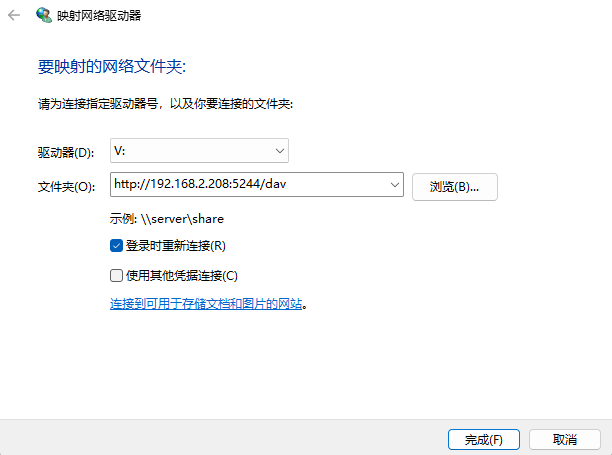
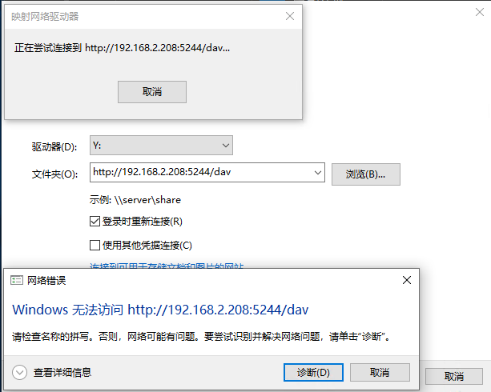
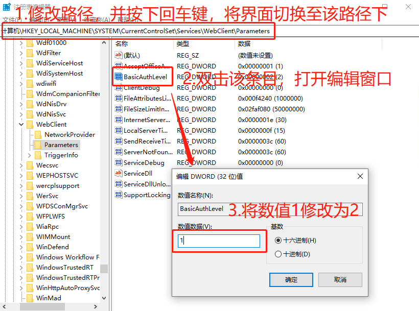
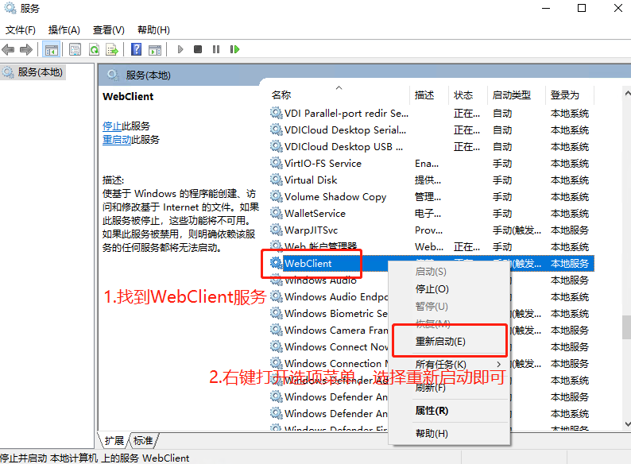
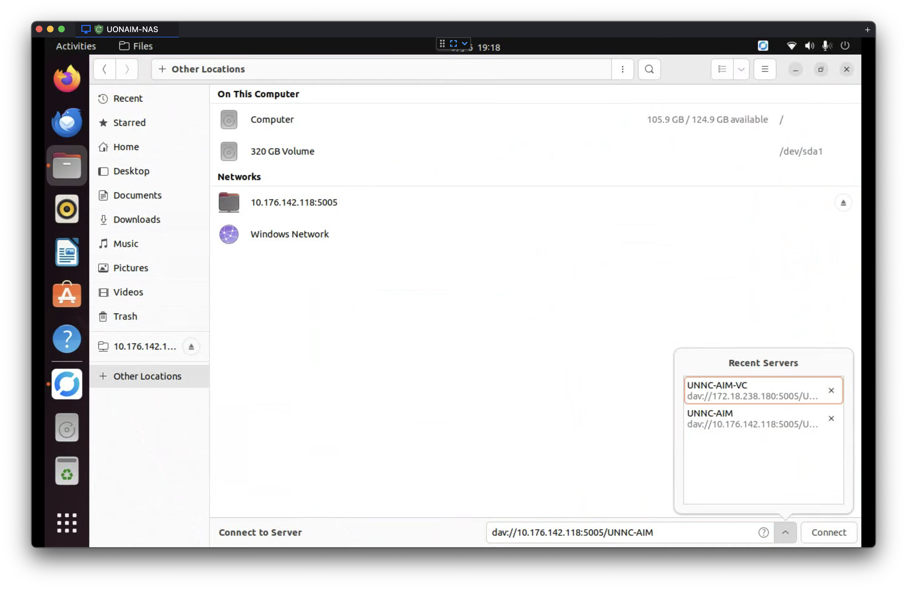
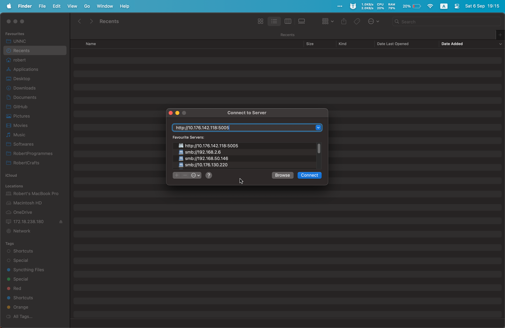

# NAS (WebDAV) 连接 / 挂载 教程（Windows / Linux / macOS）

说明：本文以 WebDAV 为例，所有示例中将 NAS 地址和端口分别替换为 `$NAS_IP` 和 `$PORT`，共享文件夹名称使用 `$FOLDER` 代替。若 NAS 的 WebDAV 根路径不是根目录（例如 `/webdav`），请将示例路径替换为实际路径。需要图片的位置已留出占位，待你插入。

---

## 通用准备

- 确认 NAS 已启用 WebDAV 服务（HTTP 或 HTTPS）并开放对应端口 `$PORT`。
- 准备好账号凭证（用户名/密码）。
- 测试连接（可用于排查）：
  - curl 测试：
    - curl -u \$USERNAME:$PASSWORD "http://\$NAS_IP:\$PORT/\$FOLDER/"
    - 或使用 HTTPS，根据 NAS 配置调整协议。

---

## Windows（GUI）

1. 打开“文件资源管理器” → 右键“此电脑” → 选择“映射网络驱动器”。
2. 选择驱动器盘符，在“文件夹”处输入 WebDAV 地址，例如：
   - `https://$NAS_IP:$PORT/$FOLDER` 或 `http://$NAS_IP:$PORT/$FOLDER`
   - 如果使用 HTTP
3. 勾选“使用其他凭据连接”，点击“完成”，输入 NAS 用户名和密码。

   

4. 成功后会在“此电脑”中看到已映射的网络驱动器。

### PowerShell 命令行（可选）

- 映射：
  - net use Z: "http://\$NAS_IP:\$PORT/\$FOLDER" /user:\$USERNAME $PASSWORD
- 取消映射：
  - net use Z: /delete

注意：Windows 对某些 HTTP WebDAV 实现兼容性有限，推荐使用 HTTPS 并确保证书受信任。

### Windows 附加教程 - 解决 HTTP WebDAV 连接问题

鉴于本地搭建的 webdav 服务和链接大多是基于 HTTP 协议的，如果碰到 HTTP 连接问题，可能是因为 Windows 默认的 WebClient 服务仅支持 https 协议，可以参考下面教程来放开 Windows 对于 HTTP 协议 WebDAV 的限制：

1. 打开注册表编辑器（按 Win + R，输入 regedit，回车）
2. 导航到以下路径：
   - HKEY_LOCAL_MACHINE\SYSTEM\CurrentControlSet\Services\WebClient\Parameters
3. 找到或创建一个名为 `BasicAuthLevel` 的 DWORD（32 位）值。
4. 将 `BasicAuthLevel` 的值设置为 `2`（允许对 HTTP 和 HTTPS 使用基本身份验证）。
   
5. 关闭注册表编辑器，再次按下 Win + R，输入 services.msc，回车。
   
6. 找到“WebClient”服务，右键选择“重新启动”。

完成上面步骤后，Windows 就可以通过 HTTP 协议连接到 WebDAV 服务器了。

---

## Ubuntu（GNOME + 命令行）

1. 安装必要组件（若尚未安装）：

   - sudo apt update && sudo apt install gvfs-backends
   - gvfs-backends 提供 Files（Nautilus）连接 WebDAV 所需的后端支持。

2. 打开文件管理器（Files / Nautilus）：

   - 在侧栏底部点击“Other Locations”（其他位置）。

3. 在“Connect to Server”（连接到服务器）输入服务器地址：

   - 使用 HTTPS（推荐）：`https://$NAS_IP:$PORT/$FOLDER`
   - 或使用 WebDAV 协议短写：`davs://$NAS_IP:$PORT/$FOLDER`（HTTPS）或 `dav://$NAS_IP:$PORT/$FOLDER`（HTTP）
   - 示例：`https://192.168.1.100:8443/shared`

4. 点击“Connect”（连接），在弹出的凭据对话框中输入 NAS 的用户名和密码：

   - 可选择“Remember forever”（保存到钥匙串/Keyring）以便下次自动连接。

5. 连接成功后：
   - WebDAV 资源会以网络位置显示在侧栏，点击即可访问。
   - 可按 Ctrl+D 或在菜单中选择“Add to Bookmarks”（添加到书签），将该位置固定到侧栏，便于下次快速打开。

常见问题与提示：

- 如果“Connect to Server”无法连接，先确认已安装 `gvfs-backends` 并重启 Files（或注销/重登录）。
- HTTPS 自签名证书会被提示信任；可在浏览器或系统钥匙串中信任证书后重试。
- 若需长期“自动挂载”以供系统级访问，GUI 方法仅在用户登录并保存凭据时生效；需要系统级持久挂载请参考 davfs2 的 fstab/systemd 方法（见文档其它部分）。
- 防火墙/路由器需放行 `$PORT`，并确保 NAS 的 WebDAV 根路径与示例一致（若不是根目录，请使用正确的子路径）。
- 若遇到凭据问题，检查 NAS 账号权限和是否启用了基于域/LDAP 的认证。

### Bash 命令行（可选）

1. 安装 davfs2：
   - sudo apt update && sudo apt install davfs2
2. 允许普通用户挂载（可选）：
   - sudo usermod -aG davfs2 $USER
   - 重新登录使组生效。
3. 创建挂载点：
   - sudo mkdir -p /mnt/nas
4. 临时挂载（测试）：
   - sudo mount -t davfs "http://\$NAS_IP:\$PORT/\$FOLDER" /mnt/nas
5. 为普通用户持久挂载（使用 ~/.davfs2/secrets 保存凭证）：
   - 在 ~/.davfs2/secrets 中添加一行：
     - http://\$NAS_IP:\$PORT/\$FOLDER \$USERNAME $PASSWORD
   - chmod 600 ~/.davfs2/secrets
   - 使用 fstab（允许 user 挂载）在 /etc/fstab 添加：
     - http://\$NAS_IP:\$PORT/\$FOLDER /mnt/nas davfs user,noauto,uid=1000,gid=1000,\_netdev 0 0
   - 然后普通用户可执行：
     - mount /mnt/nas
6. 系统启动自动挂载（可选）：
   - 将 fstab 条目去掉 noauto，或使用 systemd unit 编写自动挂载规则。

### 常见问题

- 权限错误：检查 ~/.davfs2/secrets 权限为 600。
- SSL 证书问题：若为自签名证书，可在 /etc/davfs2/davfs2.conf 配置 `trust_ca_cert` 或导入/信任证书（生产环境请尽量使用受信任证书）。

---

## macOS（Finder + 命令行）

GUI（推荐）：

1. Finder → 前往(Go) → 连接服务器，或者 Finder 下直接使用快捷键 `⌘K` ）。
2. 在服务器地址填写：
   - `https://$NAS_IP:$PORT/$FOLDER` 或 `http://$NAS_IP:$PORT/$FOLDER`
3. 点击“连接”，输入 NAS 凭据并选择保存到钥匙串（可选）。

占位图（macOS Finder 连接占位）：  

### Zsh 命令行（临时挂载）

1. 创建挂载点：
   - sudo mkdir -p /Volumes/NAS
2. 挂载：
   - sudo mount_webdav "http://\$NAS_IP:\$PORT/\$FOLDER" /Volumes/NAS
3. 卸载：
   - umount /Volumes/NAS

自动挂载/开机挂载：

- macOS 的 fstab/auto 挂载机制与 Linux 不同，通常通过登录项、AppleScript 或第三方工具实现自动连接；也可在钥匙串保存凭据以便 Finder 自动连接。

注意：使用 HTTPS 时若证书不受信任，Finder/命令行会提示信任证书。

---

## 排错要点

- 确认 NAS 的 WebDAV 服务已启用且端口 `\$PORT` 放通（防火墙/路由器端口转发）。
- 协议选用：优先 HTTPS（更安全）。
- 证书警告：若自签名证书，请在客户端信任或更换为受信 CA 证书。
- 权限和凭据：确认用户名/密码正确，Linux 上 secrets 文件权限为 600。
- 日志：查看 NAS 日志与客户端错误输出（Windows 事件查看器，Linux dmesg/系统日志，macOS Console）。
