# SVN 使用教程（命令行 + 图形界面）

本文件提供一个面向开发者和文档维护者的 Subversion (SVN) 使用教程，包含：

- 命令行安装与常用命令
- 日常工作流示例（checkout/update/commit/分支/合并）
- 常见问题与冲突处理
- Windows 下 TortoiseSVN 使用示例（图形客户端）
- 在 Visual Studio Code 中使用 SVN（安装扩展、常用操作、配置）

假设/约定：示例命令在 macOS/Linux/Windows 终端上通用，具体路径或二进制名在不同系统上可能不同（例如 `svn`）。如果本地环境使用图形客户端（如 TortoiseSVN）也可以配合使用。

---

## 写在前面 - SVN 工作原理 / 流程简介

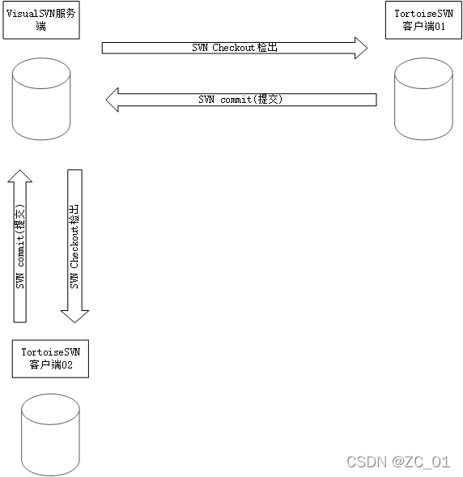

如上图所示，SVN 工作模式是：

客户端从服务器中 SVN checkout（检出）所要编制的内容，编制完成之后 SVN commit（提交）到服务器中。

---

## 本文快速链接

- [SVN 安装](#1-安装-svn)
- [命令行使用](#2-常用命令详解命令行你大概率平常不会这么用so-you-may-skip)
- [Windows TortoiseSVN 使用示例](#3-tortoisesvn-使用示例windows-图形客户端)
- [VS Code 中使用 SVN](#4-在-visual-studio-code-中使用-svn图形扩展指南)
- [常见问题](#5-常见问题faq)

## 快速链接

- 小乌龟（TortoiseSVN） — 官方网站：[https://tortoisesvn.net/](https://tortoisesvn.net/)；本文示例跳转：[TortoiseSVN 使用示例](#3-tortoisesvn-使用示例windows-图形客户端)
- VS Code 界面（在 VS Code 中使用 SVN） — 官方文档：[https://code.visualstudio.com/docs/editor/versioncontrol](https://code.visualstudio.com/docs/editor/versioncontrol)；本文示例跳转：[VS Code 中使用 SVN](#4-在-visual-studio-code-中使用-svn图形扩展指南)

---

## 命令速览（快速参考）

- 检出（checkout）：`svn checkout [URL] <path>`
- 空深度检出：`svn checkout --depth=empty [URL] <path>`（只检出目录结构，不下载文件）
- 更新（update）：`svn update` 或 `svn up`
- 添加文件：`svn add <file>`
- 提交：`svn commit -m "message"`
- 查看状态：`svn status` 或 `svn st`
- 查看差异：`svn diff` 或 `svn di`
- 查看日志：`svn log -l 20`（最近 20 条）
- 忽略文件：`svn propset svn:ignore -F .svnignore .` 或 `svn propset svn:ignore "node_modules" .`
- 解决冲突：编辑文件 -> `svn resolved <file>` 或 `svn resolve --accept working <file>`

### 参考命令速查表

- `svn checkout [URL] [dir]` - 检出
- `svn update` - 更新
- `svn add <file>` - 添加到版本控制
- `svn delete <file>` - 删除并提交
- `svn commit -m "msg"` - 提交
- `svn status` - 状态
- `svn diff` - 查看差异
- `svn log -l 50` - 最近 50 条提交
- `svn propset svn:ignore <rules>` . - 设置忽略规则
- `svn merge [URL]` - 合并
- `svn export [URL] [dir]` - 导出（无 .svn）

---

## 1. 安装 SVN

### macOS（Homebrew）

```bash
brew install svn
```

### Ubuntu / Debian

```bash
sudo apt update
sudo apt install subversion
```

### Windows

推荐图形客户端：[TortoiseSVN](https://tortoisesvn.net/)（安装后可在 Explorer 中有右键集成）

[点击下载 Windows x64 安装包](https://sourceforge.net/projects/tortoisesvn/files/1.14.9/Application/TortoiseSVN-1.14.9.29743-x64-svn-1.14.5.msi/download)

#### **注意：安装 wizard 中有一个步骤需要留意一下，命令行组件最好勾选上，如有疑惑参考 [Stack Overflow 教程](https://stackoverflow.com/questions/1625406/how-to-use-tortoisesvn-via-command-line)**

### 检验安装结果

```bash
svn --version
```

---

## 2. 常用命令详解（命令行）（你大概率平常不会这么用，so you may [skip](#3-tortoisesvn-使用示例windows-图形客户端)）

### 工作区相关

#### 从仓库检出一个工作副本

```bash
svn checkout <REPO_URL> [目标目录]
# 示例：
svn checkout https://svn.example.com/repos/project/trunk project-trunk
```

#### 空深度检出（只检出目录结构，不下载文件）

当你只想在现有仓库中添加新目录，而不想下载仓库中已有的所有文件时，可以使用空深度检出：

```bash
svn checkout --depth=empty <REPO_URL> [目标目录]
```

**使用场景：** 假设你有一个仓库 `svn://url/a`，里面已经有很多文件和目录，但你只想在其中添加一个新目录而不下载现有内容：

```bash
# 1. 空深度检出（只获取目录元信息，不下载现有文件）
svn checkout --depth=empty svn://url/a a

# 2. 进入目录并创建新目录
cd a
mkdir newdir

# 3. 添加新目录到版本控制
svn add newdir

# 4. 提交新目录到服务器
svn commit -m "Add new directory newdir under a"
```

这样，本地的 `a/` 目录中只有 `.svn/` 元数据目录和你新创建的 `newdir`，不会包含仓库中原有的其他文件和目录。

#### 更新当前工作副本到最新

```bash
svn update
```

#### 查看当前更改/状态

```bash
svn status
svn status -u   # 显示远端是否有更新
```

#### 查看某个文件或路径的详细信息

```bash
svn info path_or_url
```

### 添加 / 删除 / 重命名

#### 将新文件加入版本控制

```bash
svn add newfile.txt
```

#### 将文件标记为删除（提交后被移除）

```bash
svn delete obsolete.txt
```

#### 重命名或移动（保留历史）

```bash
svn move oldname newname
```

### 提交/日志/差异

#### 提交更改到仓库

```bash
svn commit -m "说明性提交信息"
```

#### 查看提交历史

```bash
svn log -l 50        # 最近 50 条
svn log -r BASE:HEAD # 从本地基线到最新
```

#### 查看文件差异（在本地）

```bash
svn diff [path]
```

### 分支 / 标签（使用 copy）

SVN 用目录来表示分支与标签，常见仓库布局：`/trunk`, `/branches`, `/tags`。

#### 创建分支（在服务端拷贝）

```bash
svn copy https://svn.example.com/repos/project/trunk \
 https://svn.example.com/repos/project/branches/my-feature -m "create branch my-feature"
```

#### 从分支检出/切换

```bash
svn switch https://svn.example.com/repos/project/branches/my-feature
```

### 合并

#### 将分支合并回 trunk（示例为把 `branches/my-feature` 的改动合并到当前工作副本）

```bash
# 先更新 trunk 工作副本到最新
svn update
# 在 trunk 的工作副本执行合并
svn merge https://svn.example.com/repos/project/branches/my-feature
# 解决冲突 -> 提交
svn commit -m "merge my-feature into trunk"
```

### 导出（无 .svn 元数据）

```bash
svn export https://svn.example.com/repos/project/trunk ./exported-copy
```

---

### 忽略文件（svn:ignore）

#### 设置属性方式

```bash
svn propset svn:ignore "node_modules\n.DS_Store" .
svn commit -m "set svn:ignore for project"
```

#### 也可以把规则放到一个文件然后引用

```bash
cat > .svnignore <<EOF
node_modules
.DS_Store
EOF
svn propset svn:ignore -F .svnignore .
svn commit -m "update svn:ignore"
```

---

### 冲突与恢复

#### 常见场景：两个人同时编辑同一文件，提交时出现冲突。推荐工作流

1. 提交前执行 `svn update`，把别人的改动合并到本地。
2. 如果 `svn update` 报冲突，文件会包含冲突标记（<<<<<<<、=======、>>>>>>>）。手动合并这些标记内容。
3. 合并完成后，标记为已解决

   ```bash
   svn resolve --accept working conflicted-file.txt
   # 或老的命令
   svn resolved conflicted-file.txt
   ```

4. 最后 `svn commit -m "resolve conflict for ..."`。

#### 如果想放弃本地更改，用

```bash
svn revert path/to/file
```

> 注意：`svn revert` 会丢弃本地未提交的修改。要慎用。

---

### 身份验证与凭证缓存

第一次访问需要输入用户名/密码。可以让客户端缓存凭证：

```bash
# 一般会提示是否缓存，或在 ~/.subversion/servers 与 ~/.subversion/auth 中配置
```

在 CI 或自动化脚本中，可使用 `--username` / `--password`（注意安全风险），或使用受保护的凭证管理器。

---

## 3. TortoiseSVN 使用示例（Windows 图形客户端）

TortoiseSVN 是 Windows 上流行的 SVN 图形客户端，集成在资源管理器右键菜单中。

> 摘自 <https://blog.csdn.net/qq_45527691/article/details/122302359>

阅读这部分的前提：服务器、客户端 TortoiseSVN 均已安装完成

### 1. 客户端与服务器连接

示例：在电脑 E 盘新建 SVNtest 文件夹，计划在此文件夹中来编辑服务器中检出的文件

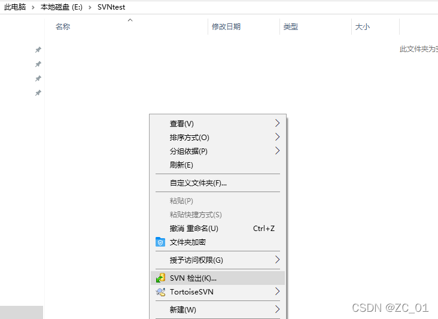

repository(版本库)的位置，对于 SVN 来说，repository 的位置都是 URL。

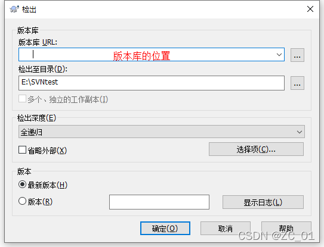

将 URL（我们会提供）输入之后点击确定，此时服务器、客户端 TortoiseSVN 已经建立连接，其中会出现一个隐藏文件夹.svn（不要删除）

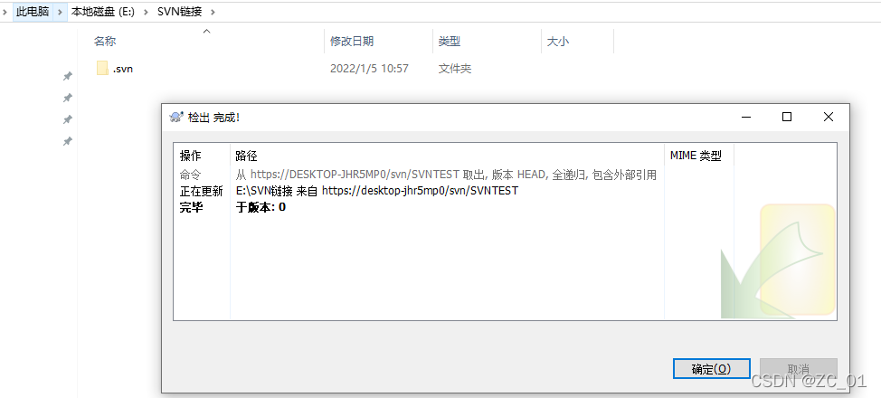

上图表示，SVN 链接文件夹与库（`https://DESKTOP-JHR5MP0/svn/SVNTEST/`）建立连接，同时检出库中的内容，因为库里无内容，所以显示版本为 0，且无其它文件夹。

### 1.1 Checkout Depth -> Only this item

> aka. 空深度检出（只检出目录，不下载现有文件）

**使用场景：** 当你想要在一个已有内容的仓库中添加新目录，但不想下载仓库中现有的所有文件时。

**操作步骤：**

1. **右键 → SVN Checkout…**

   - 在 "URL of repository" 填写仓库地址，例如：`svn://url/a`
   - 在 "Checkout directory" 选择本地存放路径，例如：`D:\svn\a`

2. **设置检出深度**

   - 在 Checkout 对话框中，找到 "Checkout Depth" 选项（默认是 "Fully recursive"）
   - **将其改为 "Only this item"**
   - 👉 这样本地只会获得目录的外壳和 `.svn` 元数据，不会下载目录下的现有文件和子目录

3. **点击 OK 完成检出**

   - 此时本地的 `D:\svn\a` 文件夹是空的（只有隐藏的 `.svn` 目录），没有原来仓库里的内容

4. **在本地新建目录**

   - 在 `D:\svn\a` 下新建一个文件夹，比如 `newdir`

5. **右键 → TortoiseSVN → Add**

   - 给 `newdir` 添加到版本控制

6. **右键 → SVN Commit…**
   - 输入提交说明，比如 "Add newdir under a"，点击 OK
   - 新目录就会上传到 `svn://url/a/newdir`，而你本地仍然没有仓库里原有的其他内容

**小结：**

- TortoiseSVN 中的 "Checkout Depth → Only this item" 对应命令行的 `svn checkout --depth=empty`
- 剩下的操作就是常规的：新建目录 → Add → Commit

### 2. SVN commit（提交）

模拟客户端 1
在上面创建好的文件夹中，创建名为：提交 0 的 word 文档

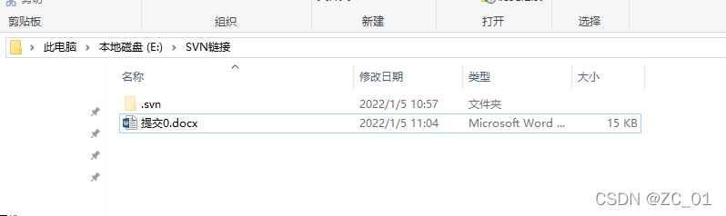

点击提交

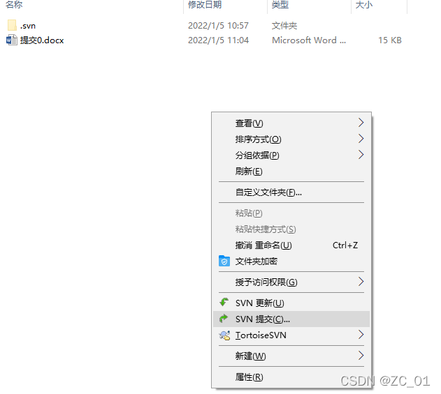

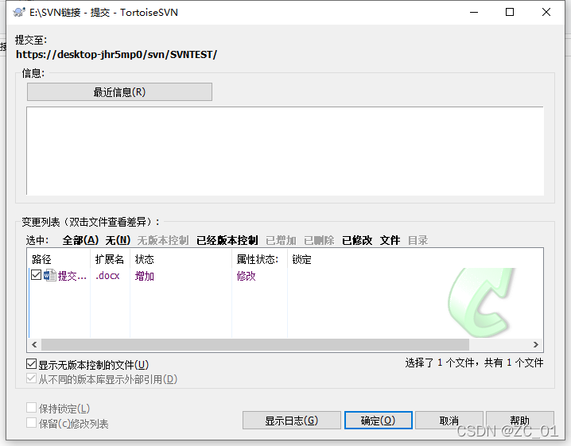

在信息中填写此次的操作，点击确定

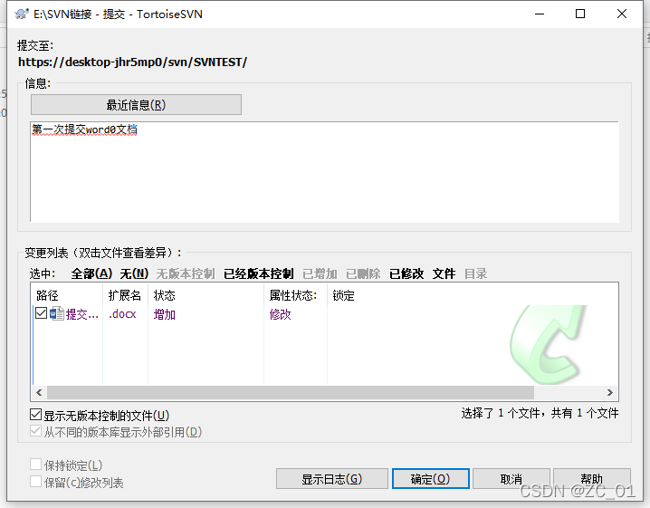

文档角标出现绿色对钩，表示成功提交至库中，同时，因为你已经对库进行了更改，增加了 word 文档，所以版本变成 1

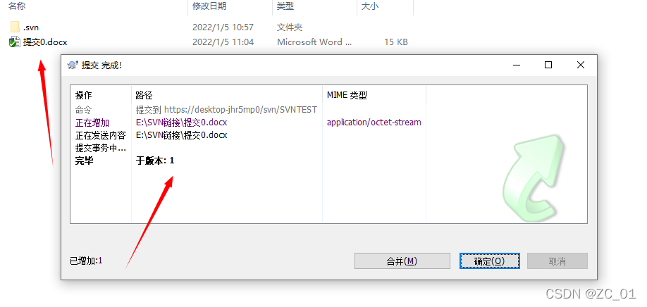

库状态：版本：1，所含内容：提交 0.docx

### 3. SVN checkout（检出）

模拟客户端 2
要对上述的库中的：提交 0.docx，进行操作
新建一个文件夹：客户端 2


同样需要先与服务器进行连接，检出–>输入库 URL

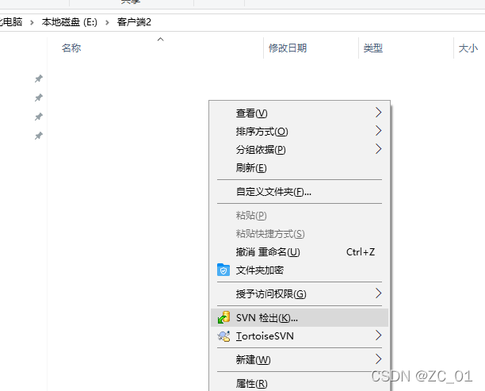

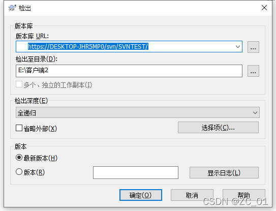

出现以下界面：

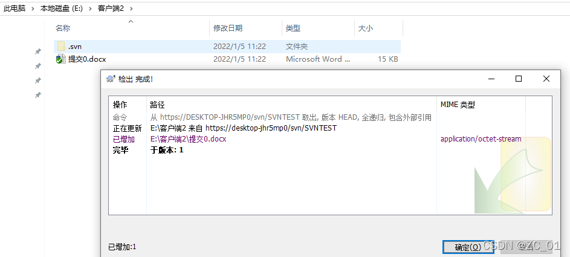

对 word 进行修改，之后出现红色叹号，表示与库中文件被修改，需要我们重新提交

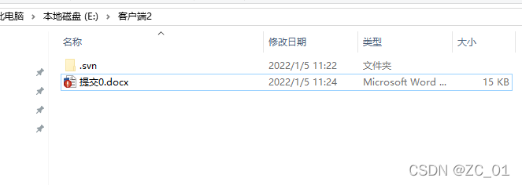

将修改内容介绍写入信息中：

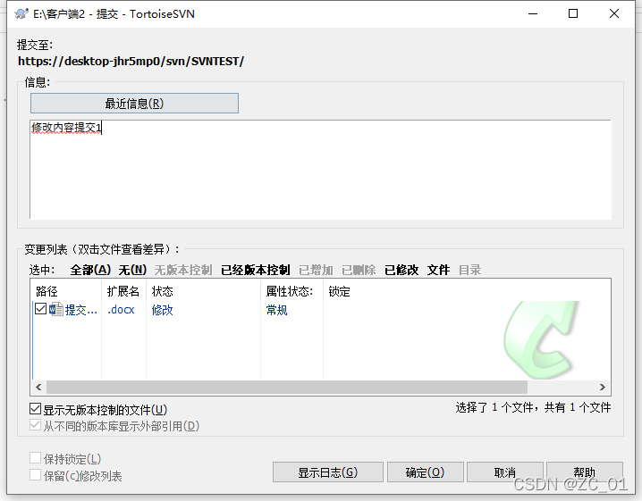

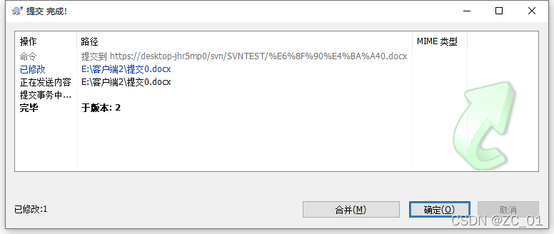

关闭客户端 2 文件夹，重新进入，可以看到出现绿色对号表示成功

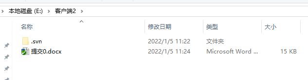

### 4. SVN Update（更新）

对上述的状态进行梳理：
库：版本 2：提交 0.docx（被修改）
客户端 1：版本 1：提交 0.docx
客户端 2：版本 2：提交 0.docx（被修改）
由此可知：
客户端 1（SVN 链接文件夹）中的版本已经落后于库
点击更新：

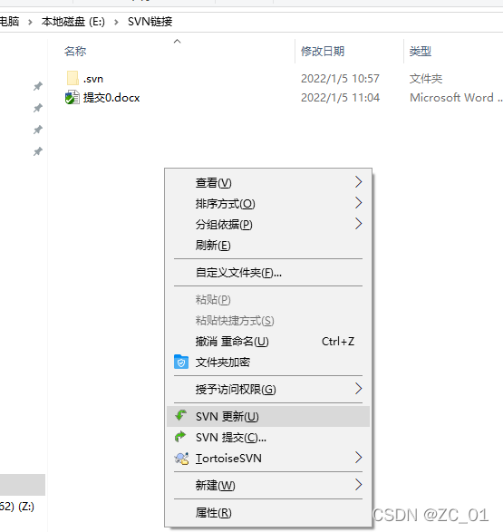

变为版本 2

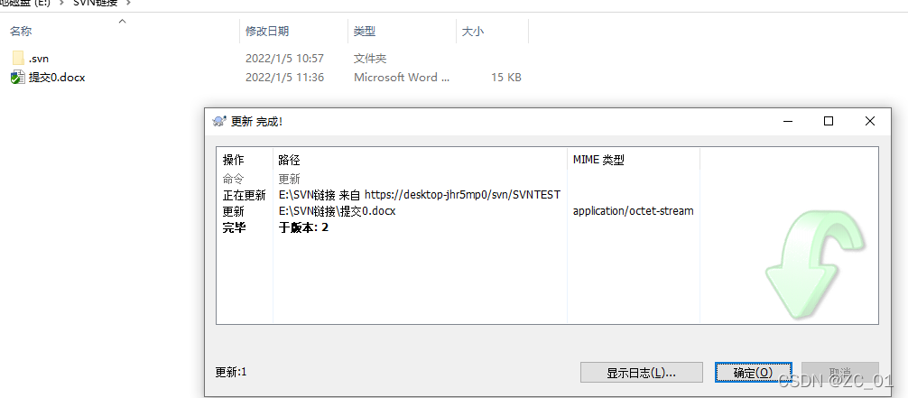

---

## 4. 在 Visual Studio Code 中使用 SVN（图形/扩展指南）

下面说明在 VS Code 中以图形或扩展方式使用 SVN 的常见步骤与建议。不同扩展提供的命令名称可能略有差别，但核心操作一致。

### 4.1 安装扩展

1. 打开 VS Code。
2. 侧边栏选择扩展（Extensions），在搜索框输入 "SVN" 或 "Subversion"。
3. 安装一个成熟的 SVN 扩展（例如常见的扩展会在扩展描述中列出命令：Checkout、Commit、Update、Log、Blame 等）。

注意：该扩展通常只是提供 UI 与命令封装，仍然需要系统中安装好 `svn` 命令行工具并可在 PATH 中访问。

### 4.2 常见图形操作（命令面板 & 源代码管理视图）

- 检出仓库：打开命令面板（Cmd/Ctrl+Shift+P），选择 `SVN: Checkout` 或扩展提供的同名命令，输入仓库 URL，选择本地目录。
- 更新：在资源管理器或命令面板执行 `SVN: Update`，或在源代码管理（Source Control）面板使用更新按钮。
- 提交：在源代码管理面板选择被更改的文件，输入提交信息，然后点击 Commit（提交）按钮。
- 日志/历史：右键文件或在命令面板中选择 `SVN: Show Log` 查看历史提交记录，通常可以按条目回溯或比较差异。
- 注释/Blame：右键文件 -> `SVN: Blame`（或命令面板）以查看每一行的提交作者/版本信息。

很多扩展还提供图形化的冲突解决指引和文件差异查看（内置 diff 窗口），方便手动合并并标记为已解决。

### 4.3 配置建议

- 指定 SVN 可执行文件路径（如果扩展找不到 `svn`）：在 `settings.json` 中配置类似 `"svn.path": "/usr/local/bin/svn"`（具体键名以扩展文档为准）。
- 配置自动更新、提交行为或默认忽略规则，参考扩展设置页。

示例（打开 VS Code 用户设置并添加，注意键名需与扩展文档对齐）：

```jsonc
{
  // 举例：如果扩展支持该配置
  "svn.path": "/usr/local/bin/svn",
  "svn.defaultMessage": "[自动提交]",
  "svn.enableTelemetry": false
}
```

### 4.4 VS Code 工作流示例

1. 使用 `SVN: Checkout` 将远端 trunk/branch 检出到本地目录，并在 VS Code 中打开该文件夹。
2. 在编辑器中修改文件，保存后在源代码管理面板查看变更（显示新增/修改/删除）。
3. 选中文件，写好提交说明，点击 Commit。
4. 在提交前可选择 `SVN: Update` 以拉取远端最新并检查冲突。若有冲突，使用 VS Code 的三方合并工具或手动编辑后标记解决。

---

## 5. 常见问题（FAQ）

Q: 提交时提示“out of date”或版本冲突怎么办？

A: 先执行 `svn update`，合并远端变更并解决冲突，然后再执行 `svn commit`。

Q: 如何撤销已添加但未提交的文件？

A: `svn revert path/to/file`（对新添加但未提交的文件，若要同时从文件系统删除，可直接 rm）。

Q: 如何查看某目录下的远程分支或标签？

A: 使用 `svn list <REPO_URL>/branches` 或 `svn list <REPO_URL>/tags`。

Q: 想把本地目录导出成不含 .svn 的发布包？

A: 使用 `svn export`（参见上文）。

> 注意，上述所有指令都可以通过 TortoiseSVN 图形界面 或者 VS Code SVN 插件的命令面板实现。

---

## 6. 小贴士与最佳实践

- 在提交前经常 `svn update`，保持与主干的同步，减少合并冲突。
- 提交信息写清楚改动目的，回溯时更容易定位。
- 使用分支进行大改动或实验性功能，合并回主分支前做好代码审查和测试。
- 在项目根目录设置 `svn:ignore`，避免把编译产物或依赖包提交到仓库。
